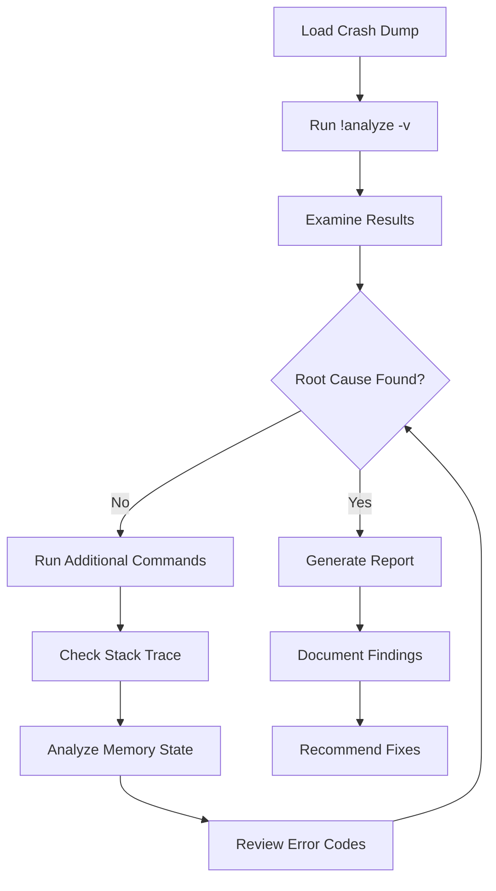
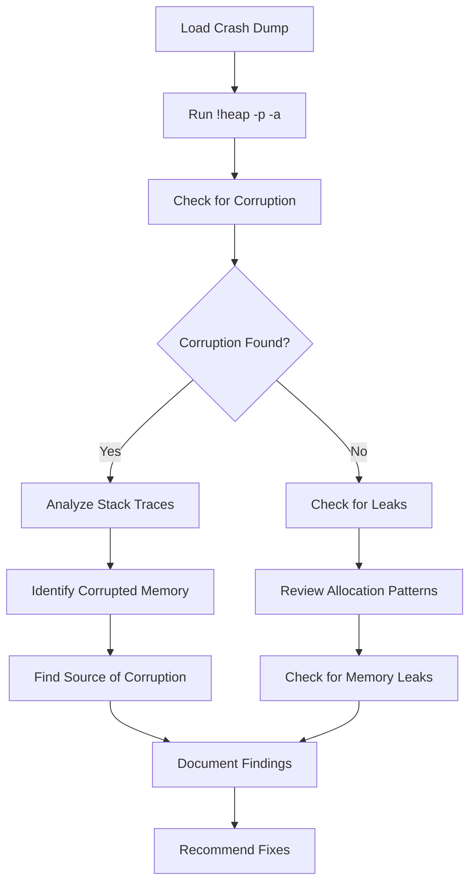
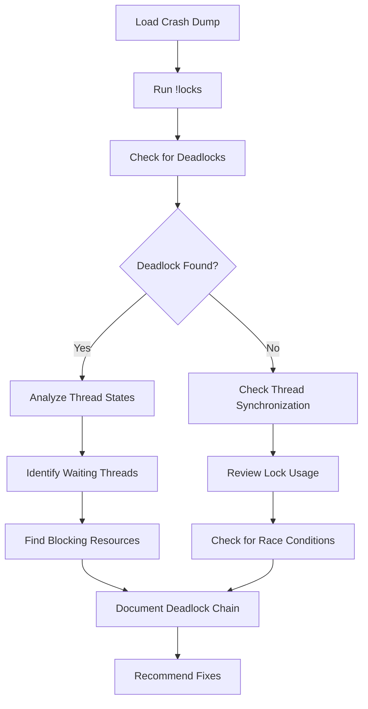

# MCP Nexus Overview

**AI-Powered Windows Crash Dump Analysis Platform**

> 🏠 **[← Back to Main README](../README.md)** | 📚 **Other Docs:** [📋 Tools](TOOLS.md) | [📚 Resources](RESOURCES.md) | [🔧 Configuration](CONFIGURATION.md) | [🤖 Integration](INTEGRATION.md)

## 🎯 What is MCP Nexus?

MCP Nexus is a platform that provides structured access to Windows debugging tools through the Model Context Protocol. It makes crash dump analysis more accessible by providing standardized tools and real-time progress tracking.

### The Problem We Solve

**Traditional Crash Analysis Challenges:**
- 🔍 **Complexity**: Requires deep knowledge of Windows internals and debugging tools
- ⏱️ **Time-consuming**: Manual analysis can take hours or days
- 🧠 **Expertise Required**: Need specialized debugging skills and experience
- 📊 **Inconsistent Results**: Different analysts may reach different conclusions
- 🔧 **Tool Complexity**: WinDBG/CDB have steep learning curves

**MCP Nexus Solution:**
- 🔧 **Structured Access**: Provides standardized tools for debugging operations
- ⚡ **Real-time Updates**: Live progress tracking and notifications
- 📚 **Consistent Results**: Provides structured output formats
- 🔄 **MCP Integration**: Works with AI clients through Model Context Protocol
- 🛠️ **Professional Tools**: Built on Microsoft's industry-standard debugging infrastructure

## 🏗️ Architecture Overview

### Core Components

#### AI Integration Layer
| Component | Description |
|-----------|-------------|
| **MCP Protocol Handler** | Handles Model Context Protocol communication |
| **Real-time Notifications** | Live progress updates during analysis |
| **AI Client** | Interface for AI-powered analysis requests |

#### Analysis Engine Core
| Component | Description |
|-----------|-------------|
| **Crash Analysis** | Core crash dump processing and analysis |
| **Memory Analysis** | Memory corruption and leak detection |
| **Thread Analysis** | Thread state and deadlock analysis |
| **Performance Analysis** | Performance bottleneck identification |
| **Pattern Recognition** | Common crash pattern detection |
| **Workflow Engine** | Orchestrates analysis workflows |

#### Microsoft Debugging Tools Integration
| Component | Description |
|-----------|-------------|
| **WinDBG/CDB Wrapper** | Interface to Microsoft debugging tools |
| **Symbol Resolution** | Symbol loading and resolution |
| **Command Queue** | Asynchronous command execution |
| **Process Management** | Process attachment and control |
| **Error Handling** | Robust error recovery and logging |
| **Result Cache** | Cached analysis results for performance |

### Analysis Workflow

1. **📁 Dump Ingestion**: Load crash dump files (.dmp, .mdmp, etc.)
2. **🔍 Initial Analysis**: Run automated analysis commands
3. **📊 Pattern Recognition**: Identify common crash patterns and causes
4. **📊 Analysis Processing**: Structured analysis of crash dump data
5. **📋 Report Generation**: Create structured analysis reports
6. **🎯 Root Cause Identification**: Pinpoint the exact cause of the crash

## 🔍 Analysis Capabilities

### Crash Types Supported

| Crash Type | Description | Analysis Approach |
|------------|-------------|-------------------|
| **💥 Application Crashes** | Unhandled exceptions, access violations | Stack trace analysis, exception context |
| **🔒 System Crashes** | Blue Screen of Death (BSOD) | Kernel analysis, driver investigation |
| **💾 Memory Corruption** | Heap corruption, buffer overflows | Memory dump inspection, allocation tracking |
| **🧵 Thread Issues** | Deadlocks, race conditions | Thread state analysis, synchronization review |
| **⚡ Performance Issues** | CPU spikes, memory leaks | Resource usage analysis, profiling |
| **🔧 Driver Problems** | Kernel driver crashes | Driver stack analysis, IRQL checking |

### Analysis Techniques

#### 1. **Stack Trace Analysis**
- **Purpose**: Understand the execution path that led to the crash
- **Tools**: `!analyze -v`, `kb`, `k`, `kv`
- **AI Integration**: Structured stack trace parsing and interpretation

#### 2. **Memory Analysis**
- **Purpose**: Identify memory corruption, leaks, and allocation issues
- **Tools**: `!heap`, `!address`, `!pool`, `!memusage`
- **AI Integration**: Pattern recognition for common memory issues

#### 3. **Thread Analysis**
- **Purpose**: Detect deadlocks, race conditions, and synchronization problems
- **Tools**: `!locks`, `!runaway`, `~*k`
- **AI Integration**: Thread state correlation and deadlock detection

#### 4. **Performance Analysis**
- **Purpose**: Identify performance bottlenecks and resource exhaustion
- **Tools**: `!runaway`, `!memusage`, `!process`
- **AI Integration**: Performance pattern recognition and optimization suggestions

#### 5. **Symbol Resolution**
- **Purpose**: Load debugging symbols for accurate analysis
- **Tools**: Automatic symbol loading, symbol server integration
- **AI Integration**: Intelligent symbol path resolution and caching

## 🤖 AI Integration Benefits

### For AI Systems

**Structured Data Access:**
- **Consistent APIs**: Standardized MCP protocol for tool interaction
- **Real-time Updates**: Live progress notifications during analysis
- **Rich Metadata**: Detailed context about crashes, systems, and analysis results
- **Extensible Workflows**: Custom analysis patterns and workflows

**Intelligent Analysis:**
- **Pattern Recognition**: AI can identify common crash patterns automatically
- **Context Awareness**: Understanding of system state and crash context
- **Learning Capability**: AI can improve analysis based on historical data
- **Automated Reporting**: Generate human-readable analysis reports

### For Developers

**Simplified Integration:**
- **MCP Protocol**: Standard protocol for AI tool integration
- **Real-time Feedback**: Live updates during long-running analysis
- **Error Handling**: Comprehensive error reporting and recovery
- **Documentation**: Rich documentation and examples

**Professional Results:**
- **Industry Standards**: Built on Microsoft's debugging tools
- **Comprehensive Analysis**: Deep analysis of complex crash scenarios
- **Actionable Insights**: Clear recommendations for fixing issues
- **Consistent Quality**: Standardized analysis approach

## 📊 Analysis Workflows

### Basic Crash Analysis Workflow

### Memory Corruption Analysis Workflow

### Thread Deadlock Analysis Workflow

## 🛠️ Technical Implementation

### MCP Protocol Integration

**Tool Definitions:**
- **Standardized Schemas**: Consistent tool definitions for AI consumption
- **Rich Metadata**: Detailed descriptions and parameter specifications
- **Error Handling**: Comprehensive error reporting and recovery
- **Real-time Updates**: Live progress notifications during analysis

**Resource Management:**
- **Session Tracking**: Persistent analysis sessions with state management
- **Command Queuing**: Asynchronous command execution with progress tracking
- **Result Caching**: Intelligent caching of analysis results
- **Resource Cleanup**: Automatic cleanup of analysis resources

### Debugging Tools Integration

**WinDBG/CDB Wrapper:**
- **Process Management**: Automated process lifecycle management
- **Command Execution**: Safe execution of debugging commands
- **Output Parsing**: Intelligent parsing of debugging tool output
- **Error Handling**: Robust error handling and recovery

**Symbol Resolution:**
- **Automatic Loading**: Intelligent symbol loading and caching
- **Symbol Servers**: Integration with Microsoft symbol servers
- **Path Resolution**: Automatic symbol path resolution
- **Error Recovery**: Graceful handling of symbol loading failures

## 📈 Performance and Scalability

### Analysis Performance
- **Async Processing**: Non-blocking analysis with progress tracking
- **Resource Management**: Efficient memory and CPU usage
- **Caching**: Intelligent caching of analysis results
- **Parallel Processing**: Concurrent analysis of multiple dumps

### Scalability Features
- **Session Management**: Support for multiple concurrent analysis sessions
- **Command Queuing**: Efficient queuing and execution of analysis commands
- **Resource Cleanup**: Automatic cleanup of analysis resources
- **Error Recovery**: Robust error handling and recovery mechanisms

## 🎯 Getting Started

### Quick Start
1. **Install MCP Nexus**: Follow the installation guide
2. **Configure AI Client**: Set up Cursor IDE or Claude Desktop
3. **Load Crash Dump**: Use the analysis tools to load a dump
4. **Run Analysis**: Execute analysis commands and review results
5. **Generate Report**: Create structured analysis reports

### Next Steps
- **📋 Tools**: [TOOLS.md](TOOLS.md) - Learn about available analysis tools
- **📚 Resources**: [RESOURCES.md](RESOURCES.md) - Understand MCP resources
- **🔧 Configuration**: [CONFIGURATION.md](CONFIGURATION.md) - Configure your environment
- **🤖 Integration**: [INTEGRATION.md](INTEGRATION.md) - Set up AI integration
- **📊 Examples**: [USAGE_EXAMPLES.md](USAGE_EXAMPLES.md) - See analysis workflows in action

---

**MCP Nexus** - Professional Windows crash dump analysis using Microsoft debugging tools.
